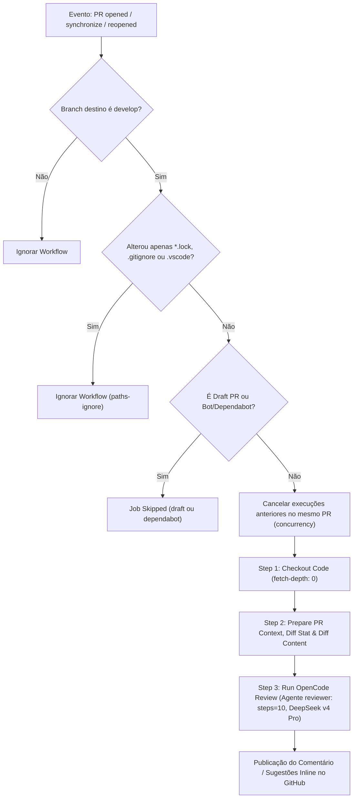
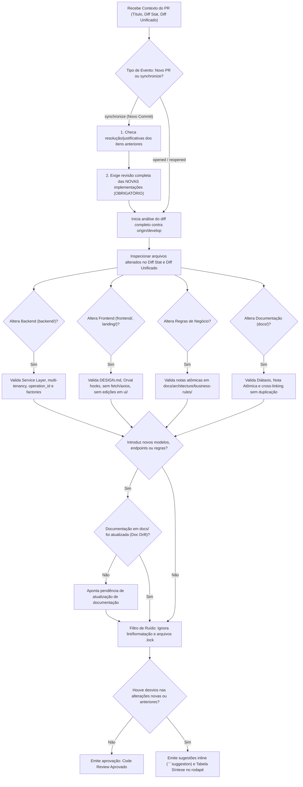

# Especificação Técnica: Workflows de IA (`ai-code-review.yml` & `opencode-assistant.yml`)

> **Módulo:** CI/CD | [ci-pr-validation-spec](ci-pr-validation-spec.md) | [ci-cd-pipeline-flow](../../architecture/concepts/ci-cd-pipeline-flow.md)
> **Workflows:** `.github/workflows/ai-code-review.yml` | `.github/workflows/opencode-assistant.yml`

---

## 1. Visão Geral

Os workflows de IA realizam auditorias automáticas de código e prestam assistência interativa aos desenvolvedores diretamente nos Pull Requests do GitHub.

---

## 2. Workflows Implementados

### 2.1 `ai-code-review.yml` (Revisão Automática por SHA)

- **Gatilho**: Disparado automaticamente na abertura, reabertura ou envio de novos commits (`synchronize`) em Pull Requests direcionados para `develop`.
- **Isolamento de Estado**: Analisa estritamente o diff do SHA atual do commit contra `origin/develop`. Não utiliza labels do GitHub como armazenamento de estado.
- **Auditoria de Qualidade**: Avalia o diff procurando violações de multi-tenancy, queries N+1, falhas de acessibilidade, desvios do Design System e quebras do padrão da camada de serviços (`services.py`).
- **Feedback**: Publica o relatório da revisão como comentário estruturado e sugestões inline (_1-click apply_) no Pull Request.

### 2.2 `opencode-assistant.yml` (Assistente Interativo)

- **Gatilho**: Disparado sob demanda quando um desenvolvedor comenta `/opencode` em um Pull Request ou issue.
- **Capacidade**: Executa diagnósticos de falhas de teste, gera sugestões de refatoração e auxilia na resolução de dúvidas de arquitetura.

---

## 3. Fluxo de Execução da Pipeline (`ai-code-review.yml`)

O diagrama abaixo ilustra o ciclo de vida da Action no GitHub Actions desde o disparo do evento até a execução do job:

---

## 4. Fluxo de Decisão Interna da IA (System Prompt)

O diagrama abaixo detalha o caminho lógico percorrido pela IA (DeepSeek v4 Pro) ao processar o prompt e avaliar o código do Pull Request:

---

## 5. Diretrizes de Qualidade, Eficiência & Roteamento Dinâmico

1. **Filtro de Bots & Dependabot**: Execuções originadas por bots de atualização de dependências (`dependabot[bot]`) são ignoradas no nível do job, evitando desperdício de saldo em revisões de bumps de pacotes.
2. **Diff Unificado Pré-Injetado**: O step preparatório extrai uma amostra limpa de até 400 linhas do diff (excluindo lockfiles, `openapi.json` e arquivos gerados/minificados), eliminando chamadas redundantes de ferramentas de terminal para descobrir as alterações.
3. **Agente Especializado (`reviewer`) com Step Limiting**: Configurado em `opencode.json` com `mode: primary`, `steps: 10` e permissões de somente leitura (`edit: deny`, `write: deny`), prevenindo loops desnecessários de exploração.
4. **Prefix Caching Optimization**: As regras fixas (`AGENTS.md`, `DESIGN.md`, `SKILL.md`) são mantidas no topo do prompt para aproveitar o _prefix caching_ do DeepSeek (reduzindo custos de tokens de entrada repetidos).
5. **Dupla Checagem em Re-Revisões (`synchronize`)**: A IA é instruída a validar a resolução dos apontamentos anteriores E obrigatoriamente realizar a revisão estática completa de todo o código novo adicionado no commit, evitando aprovação prematura por ancoragem.
6. **Roteamento por Escopo**: A IA consulta apenas as skills e especificações relevantes aos arquivos alterados listados no `Diff Stat`.
7. **Análise Estática Exclusiva**: A IA não executa comandos de shell ou testes durante a revisão, delegando validações dinâmicas às demais pipelines de CI.
8. **Validação de Doc Drift**: Alterações que modifiquem schemas, endpoints ou regras de negócio exigem a atualização ou criação correspondente da nota atômica sob `docs/`.
