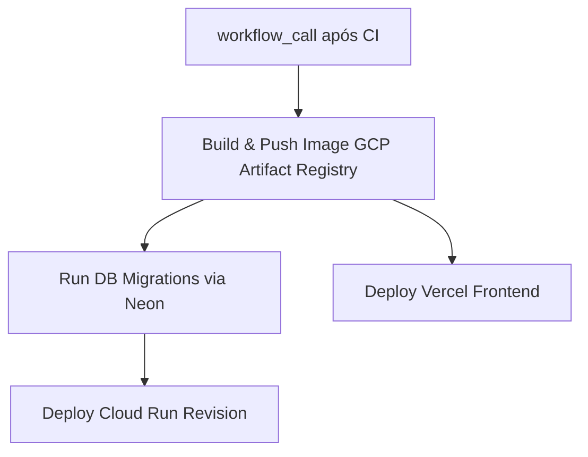

# Especificação Técnica: Workflow `cd-deploy.yml`

> **Módulo:** [ci-cd](index.md) | [ci-cd-pipeline-flow](../../architecture/concepts/ci-cd-pipeline-flow.md)
> **Workflow:** `.github/workflows/cd-deploy.yml`

---

## 1. Visão Geral

O workflow **`cd-deploy.yml`** é responsável pela entrega contínua (CD) da aplicação nas plataformas **Google Cloud Run**, **Neon Database** e **Vercel**.

Ele é invocado de forma automática via `workflow_call` após o sucesso do `ci-pr-validation.yml` em `develop` ou `main`, ou manualmente via `workflow_dispatch`.

---

## 2. Ambientes de Deployment

| Branch Target | GitHub Environment | Target Cloud Run | Target Vercel | Neon DB Target |
|:---|:---|:---|:---|:---|
| `develop` | `Preview` (Staging) | `wedding-backend-staging` | Staging Alias | `staging` branch |
| `main` | `Production` | `wedding-backend-prod` | Production Domain | `main` (production) |

---

## 3. Etapas da Pipeline de CD

### 3.1 Build & Push da Imagem Docker
- Autenticação na GCP via Workload Identity Federation (WIF).
- Compilação da imagem rotulada com o SHA curto do commit (`:${GITHUB_SHA:0:7}`).
- Push para o repositório no Google Artifact Registry.

### 3.2 Execução de Migrações do Banco de Dados
- Conexão segura com a string Neon do ambiente.
- Execução síncrona de `python manage.py migrate --noinput`.

### 3.3 Atualização da Revisão do Cloud Run
- Deploy da nova revisão no serviço Cloud Run.
- **Não altera bindings de IAM público** (o gerenciamento de invocador público `roles/run.invoker` é exclusivo do Terraform).

### 3.4 Deploy do Frontend na Vercel
- Deploy do bundle compilado para a Vercel com a URL da API injetada via ambiente.
