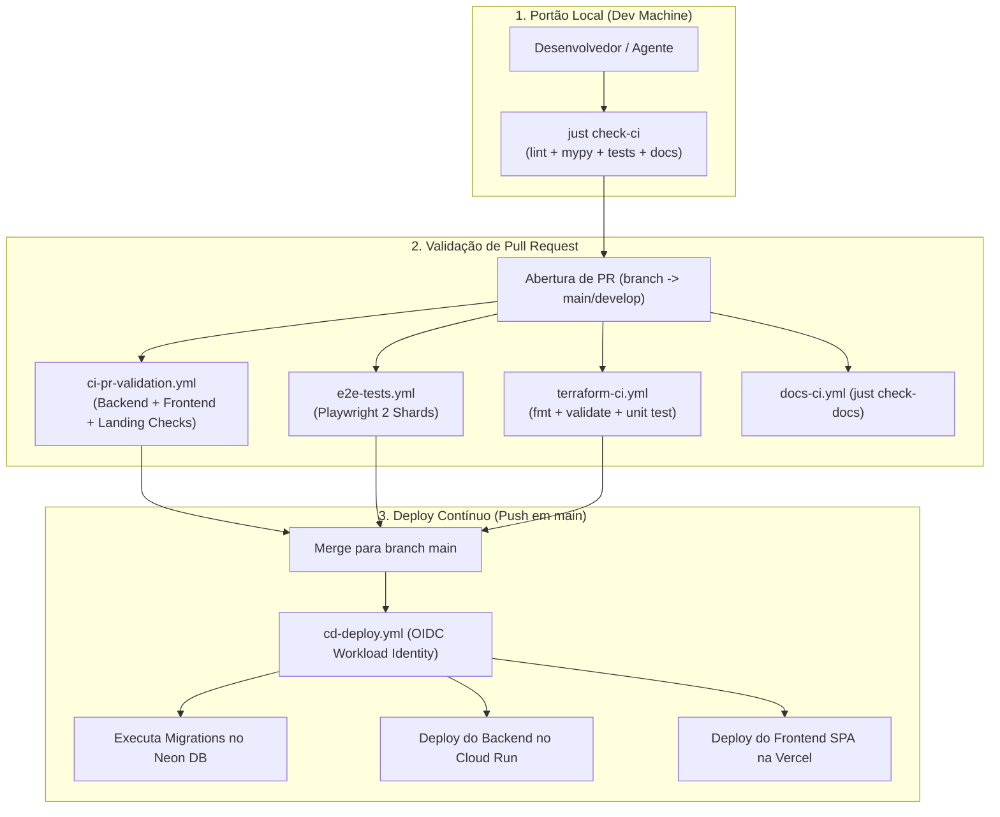

# Especificações Técnicas de CI/CD e Workflows (MOC)

> **Categoria:** Referência Técnica (CI/CD & DevOps)
> **Relacionados:** [Fluxo de CI/CD](../../architecture/concepts/ci-cd-pipeline-flow.md) · [Estratégia GitOps](../../architecture/adr/026-gitops-branching-and-deployment-strategy.md) · [MOC de Arquitetura](../architecture-standards/index.md)

---

## 1. Visão Geral da Automação GitOps

A infraestrutura de integração e entrega contínua (CI/CD) do **Wedding Management System** é orquestrada através do **GitHub Actions**, seguindo princípios estritos de **GitOps, isolamento de segredos via OIDC e portões de qualidade automatizados**.



---

## 2. Portão de Validação Local (`just check-ci`)

Antes de submeter qualquer Pull Request, o desenvolvedor deve rodar o portão local unificado:

```bash
# Executa a verificação completa de todos os subsistemas
just check-ci
```

Este comando orquestra:
1. `just check-docs`: Validação de links, tags PyMdown e build estrito do MkDocs.
2. `just check-backend`: Ruff lint/format, Mypy strict, suíte Pytest e guard-rails.
3. `just check-frontend`: ESLint/Oxlint, TypeScript `tsc`, Vitest e build de produção do Vite.
4. `just check-landing`: Astro check e build da Landing Page.

---

## 3. Catálogo de Especificações Atômicas de Workflows

| Workflow | Arquivo no Repositório | Gatilho (Trigger) | Link da Especificação |
| :--- | :--- | :--- | :--- |
| **Validação de PR (CI)** | `.github/workflows/ci-pr-validation.yml` | `pull_request` | [ci-pr-validation-spec.md](ci-pr-validation-spec.md) |
| **Deploy Contínuo (CD)** | `.github/workflows/cd-deploy.yml` | `push` em `main` | [cd-deploy-spec.md](cd-deploy-spec.md) |
| **Pipelines Terraform** | `.github/workflows/terraform-ci.yml`, `staging-pipeline.yml` | `pull_request`, `push` em `main`/`develop` | [terraform-pipelines-spec.md](terraform-pipelines-spec.md) |
| **Revisão com IA** | `.github/workflows/ai-code-review.yml`, `opencode-assistant.yml` | `pull_request` aberto/atualizado | [ai-code-review-spec.md](ai-code-review-spec.md) |
| **Testes E2E** | `.github/workflows/e2e-tests.yml` | `pull_request` no frontend | [../testing/e2e-testing-spec.md](../testing/e2e-testing-spec.md) |
| **Auditoria de Documentação** | `.github/workflows/docs-ci.yml` | Alterações em `docs/` e `*.md` | [../architecture-standards/documentation-standards.md](../architecture-standards/documentation-standards.md) |
| **Segurança SAST** | `.github/workflows/codeql.yml` | Agendamento semanal e PRs | [../architecture-standards/guard-rails/security-permissions-guard.md](../architecture-standards/guard-rails/security-permissions-guard.md) |
