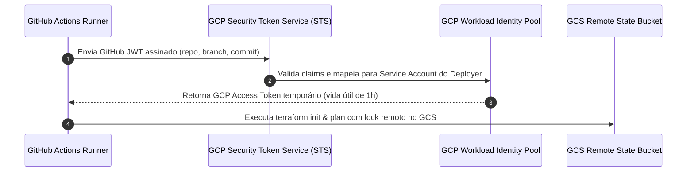
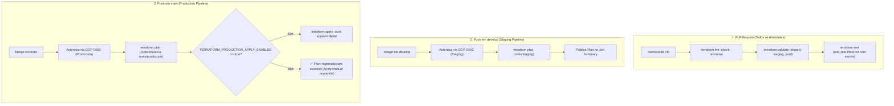

# Especificação Técnica: Pipelines de Infraestrutura Terraform (IaC & OIDC)

> **Categoria:** Referência Técnica (CI/CD & DevOps)
> **Relacionados:** [MOC de CI/CD](index.md) · [ADR-025: Arquitetura Terraform](../../architecture/adr/025-terraform-iac-architecture.md) · [ADR-027: Topologia de States](../../architecture/adr/027-terraform-state-topology.md) · [MOC de Terraform](../terraform/index.md)
> **Workflows:** `.github/workflows/terraform-ci.yml` e `.github/workflows/staging-pipeline.yml`

---

## 1. Visão Geral e Autenticação Sem Chaves (GCP OIDC WIF)

Os workflows de infraestrutura gerenciam a validação sintática, planejamento de mudanças HCL e aplicação controlada do Terraform sob os três roots desacoplados (`shared`, `staging`, `production`).

A comunicação com o Google Cloud Platform e Cloudflare é **100% livre de chaves estáticas de longa duração** (Service Account Keys JSON). Em vez disso, o GitHub Actions utiliza **Workload Identity Federation (WIF)** através de tokens OIDC efêmeros.

---

## 2. Topologia de Workflows e Fases de Execução

---

## 3. Detalhamento dos Workflows

### 3.1 `terraform-ci.yml` (Validação de PR e Produção)
- **Em Pull Requests:**
  - `terraform fmt -check -recursive`: Garante formatação canônica HCL.
  - `terraform init -backend=false`: Inicializa módulos localmente sem consultar o storage remoto.
  - `terraform validate`: Valida tipos, variáveis obrigatórias e referências nos 3 roots.
  - `terraform test`: Executa asserções declarativas em `tests/unit_test.tftest.hcl` usando `mock_provider` nativo (consulte [terraform-testing-spec](../testing/terraform-testing-spec.md)).
  - **Segurança:** PRs **nunca** recebem tokens OIDC da GCP e não acessam o estado remoto.

- **Em Push na branch `main` (Produção):**
  - Conecta ao Workload Identity Pool do GCP.
  - Inicializa o backend GCS em `gs://<project-id>-tfstate/roots/shared/` e `gs://<project-id>-tfstate/roots/production/`.
  - Gera os planos binários de execução: `terraform plan -out=shared.tfplan` e `terraform plan -out=prod.tfplan`.
  - **Trava de Segurança (Opt-In Apply):** A execução de `terraform apply` é estritamente condicionada à variável de repositório `TERRAFORM_PRODUCTION_APPLY_ENABLED == "true"`.

---

### 3.2 `staging-pipeline.yml` (Homologação Contínua)
- **Em Push na branch `develop` (Staging):**
  - Conecta ao ambiente GCP de staging via OIDC.
  - Gera o plano de mudanças para `roots/staging/`.
  - Publica o relatório detalhado do `plan` no resumo do GitHub Actions (`$GITHUB_STEP_SUMMARY`).
  - **Regra de Ouro:** O workflow de staging **nunca** executa apply automático destrutivo.

---

## 4. Travas de Segurança e Isolamento

1. **State Locking Concorrente:** As operações remotas utilizam o mecanismo de locking nativo do GCS sob o grupo de concorrência GitHub Actions `concurrency: terraform-remote-state`.
2. **`prevent_destroy = true`:** Recursos críticos (serviço Cloud Run, contêineres de segredos no Secret Manager, buckets de contratos R2) possuem a diretiva `lifecycle { prevent_destroy = true }`, impedindo deleções acidentais.
3. **`ignore_changes` para o CD:** O recurso `google_cloud_run_v2_service` ignora alterações na tag de imagem `template[0].containers[0].image`, permitindo que o pipeline de CD da aplicação faça novos deploys sem intervenção do Terraform.
