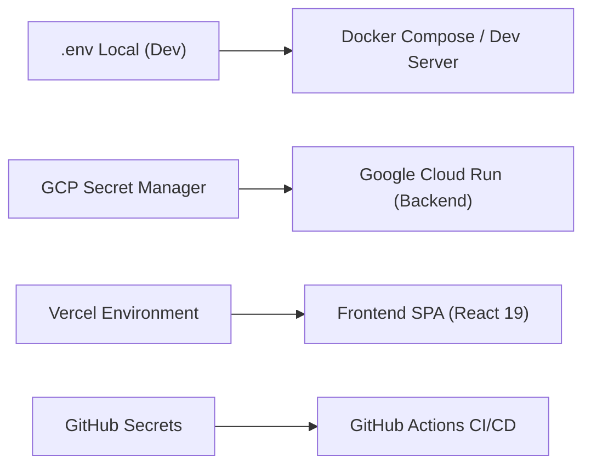

# Especificação Técnica: Dicionário Exaustivo de Variáveis de Ambiente (.env)

> **Categoria:** Referência Técnica (Ambiente & Configurações)
> **Relacionados:** [Guia de Ambiente Local](../../guides/dev-environment/index.md) · [Visão Geral da Arquitetura](../../architecture/concepts/system-overview.md) · [CI/CD Pipelines](../ci-cd/index.md)

---

## 1. Visão Geral e Gestão de Segredos

O **Wedding Management System** opera sob o padrão *Twelve-Factor App*, configurando ambientes via variáveis de ambiente estritas.

### Topologia de Injeção de Variáveis
- **Desenvolvimento Local:** Arquivos `.env` locais na raiz de `backend/`, `frontend/` e `landing/` (ignorados pelo Git).
- **CI/CD (GitHub Actions):** Injeção de variáveis efêmeras via GitHub Secrets e Workload Identity Federation (WIF).
- **Produção (Cloud Run & Vercel):** Segredos montados dinamicamente via **GCP Secret Manager** e variáveis de build/runtime na **Vercel**.

---

## 2. Backend (`backend/.env`)

| Variável | Tipo | Requerida | Padrão / Exemplo | Descrição |
| :--- | :--- | :--- | :--- | :--- |
| `DEBUG` | boolean | Sim | `True` (dev) / `False` (prod) | Habilita o modo debug e páginas detalhadas de erro. |
| `SECRET_KEY` | string | Sim | `django-insecure-dev-key...` | Chave criptográfica para assinaturas de cookies e sessões. |
| `DJANGO_SETTINGS_MODULE` | string | Sim | `config.settings.development` | Módulo de configurações ativo (`development`, `production`). |
| `ALLOWED_HOSTS` | string | Sim | `localhost,127.0.0.1,*.run.app` | Lista separada por vírgulas de domínios aceitos pelo Django. |
| `DATABASE_URL` | string | Sim | `postgresql://<usuario>:<senha>@<host>/wedding_db?sslmode=require` | String de conexão PostgreSQL (Neon Serverless com Pooling). |
| `CORS_ALLOWED_ORIGINS` | string | Sim | `http://localhost:5173,http://localhost:4321` | Origens autorizadas para requisições cross-origin pelo CORS. |
| `CSRF_TRUSTED_ORIGINS` | string | Sim | `http://localhost:5173,https://*.vercel.app` | Origens confiáveis para submissão de formulários e CSRF. |
| `R2_ACCOUNT_ID` | string | Não | `a1b2c3d4e5f6...` | Account ID do Cloudflare para chamadas à API S3 compatível. |
| `R2_ACCESS_KEY_ID` | string | Não | `r2_access_key_xyz...` | Access Key ID para buckets de mídia/contratos no R2. |
| `R2_SECRET_ACCESS_KEY` | string | Não | `r2_secret_key_abc...` | Secret Access Key do Cloudflare R2. |
| `R2_BUCKET_NAME` | string | Não | `wedding-contracts-prod` | Nome do bucket R2 para upload de PDFs e fotos de eventos. |
| `R2_CUSTOM_DOMAIN` | string | Não | `https://media.wedding.com.br` | Domínio público customizado com CDN associado ao bucket. |
| `NINJA_JWT_ACCESS_EXPIRATION_MINUTES` | int | Sim | `60` | Tempo de vida (em minutos) do Access Token JWT. |
| `NINJA_JWT_REFRESH_EXPIRATION_DAYS` | int | Sim | `7` | Tempo de vida (em dias) do Refresh Token JWT. |
| `EMAIL_HOST` | string | Não | `smtp.resend.com` | Host SMTP para envio de notificações por email. |
| `EMAIL_PORT` | int | Não | `587` | Porta do servidor SMTP (normalmente 587 para TLS). |
| `EMAIL_HOST_USER` | string | Não | `resend` | Usuário de autenticação SMTP. |
| `EMAIL_HOST_PASSWORD` | string | Não | `re_123456789...` | Senha ou API Key do provedor de e-mail. |
| `DEFAULT_FROM_EMAIL` | string | Não | `Wedding <nao-responda@wedding.com.br>` | Remetente padrão das mensagens disparadas pelo sistema. |
| `SENTRY_DSN` | string | Não | `https://xyz@sentry.io/12345` | DSN de telemetria e captura de exceções em produção. |

---

## 3. Frontend SPA (`frontend/.env`)

| Variável | Tipo | Requerida | Padrão / Exemplo | Descrição |
| :--- | :--- | :--- | :--- | :--- |
| `VITE_API_URL` | string | Sim | `http://localhost:8000` | URL base do backend Django Ninja consumida pelo Orval. |
| `VITE_APP_NAME` | string | Não | `Wedding Management` | Nome da aplicação exibido na barra de navegação e títulos. |
| `VITE_ENVIRONMENT` | string | Sim | `development` / `production` | Ambiente de execução para exibição de badges e debug. |
| `VITE_SENTRY_DSN` | string | Não | `https://abc@sentry.io/67890` | DSN do Sentry no browser para captura de erros React. |

---

## 4. Landing Page Comercial (`landing/.env`)

| Variável | Tipo | Requerida | Padrão / Exemplo | Descrição |
| :--- | :--- | :--- | :--- | :--- |
| `PUBLIC_APP_URL` | string | Sim | `http://localhost:5173` | URL de redirecionamento para o login/registro do SPA. |
| `PUBLIC_API_URL` | string | Sim | `http://localhost:8000` | URL pública da API para formulários de lead e contato. |
| `SITE_URL` | string | Sim | `https://wedding.com.br` | URL canônica do portal para meta tags de SEO e sitemap. |
| `PUBLIC_GA_MEASUREMENT_ID` | string | Não | `G-XXXXXXXXXX` | ID de rastreamento do Google Analytics 4. |

---

## 5. Variáveis e Segredos de CI/CD e Terraform

| Variável / Segredo | Escopo | Descrição |
| :--- | :--- | :--- |
| `GCP_PROJECT_ID` | GitHub Actions | ID do projeto no Google Cloud Platform. |
| `GCP_WIF_PROVIDER` | GitHub Actions | Caminho do Workload Identity Pool Provider para autenticação OIDC. |
| `GCP_SERVICE_ACCOUNT` | GitHub Actions | Email da Service Account com permissões de deploy. |
| `TERRAFORM_PRODUCTION_APPLY_ENABLED` | GitHub Actions | Trava booleana (`true`/`false`) para autorizar o `terraform apply` em produção. |
| `CLOUDFLARE_API_TOKEN` | Terraform / GHA | Token de autenticação para gerenciar DNS e buckets R2. |
| `VERCEL_TOKEN` | GitHub Actions | Token de API para deploys automatizados na Vercel. |
| `VERCEL_ORG_ID` & `VERCEL_PROJECT_ID` | GitHub Actions | Identificadores organizacionais da Vercel. |

---

## 6. Diretrizes de Segurança

1. **Proibição de Commit de Segredos:** O arquivo `.gitignore` bloqueia `.env`, `.env.local` e `*.pem`.
2. **Rotação de Chaves:** A chave `SECRET_KEY` pode ser rotacionada sem downtime executando `make secret-key`.
3. **Guard-Rail de Schemas:** O teste `test_sensitive_data_leak.py` garante que nenhuma variável de segredo seja serializada na API pública.
