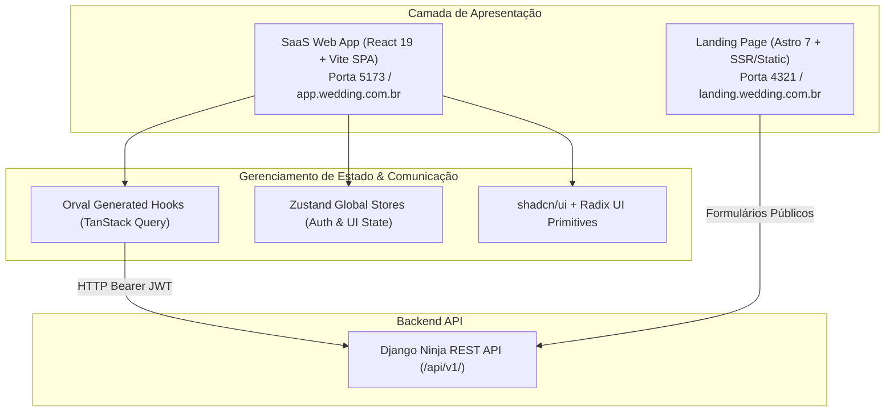

# Especificações Técnicas do Frontend (MOC)

> **Categoria:** Referência Técnica (Frontend & Apresentação)
> **Relacionados:** [Visão Geral da Arquitetura](../../architecture/concepts/system-overview.md) · [Smart vs Dumb Components](../../architecture/concepts/smart-dumb-components.md) · [Design System](../../architecture/concepts/design-system-rationale.md) · [MOC de Testes](../testing/index.md)

---

## 1. Visão Geral da Camada de Apresentação

O ecossistema de interface do **Wedding Management System** adota uma **arquitetura híbrida moderna**, dividida em duas aplicações especializadas:

1. **SPA de Gestão SaaS (`frontend/`):** Construído com **React 19**, **TypeScript**, **Vite**, **Tailwind CSS v4**, **shadcn/ui**, **TanStack Query v5**, **Zustand** e hooks gerados automaticamente via **Orval**. Focado em alta interatividade, respostas instantâneas e fluxos densos de assessoria.
2. **Landing Page Comercial (`landing/`):** Construído com **Astro 7**, **Tailwind CSS v4** e arquitetura de ilhas reativas (*Astro Islands*). Focado em performance máxima (100 no Google Lighthouse), zero JavaScript desnecessário e otimização para motores de busca (SEO).

---

## 2. Guard-Rails Normativos de Frontend

1. **Acesso à API Restrito a Hooks Gerados:** É terminantemente **proibido** utilizar `fetch()` ou `axios` diretamente nos componentes. Todo acesso aos endpoints deve utilizar os hooks tipados gerados pelo Orval em `@/api/generated/`.
2. **Imutabilidade de Componentes Primitivos:** **Nunca** altere diretamente os arquivos em `src/components/ui/`. A customização visual e de comportamento deve ser realizada via composição em `src/features/<modulo>/components/`.
3. **Formulários e Ícones Padronizados:** Uso exclusivo de `react-hook-form` + `zod` para controle e validação de formulários e `lucide-react` para iconografia.
4. **Desacoplamento Smart vs Dumb (ADR-024):** Separação estrita entre componentes inteligentes (que consomem hooks de API) e componentes burros de apresentação pura.

---

## 3. Catálogo de Especificações Atômicas

| Especificação | Escopo / Tecnologia | Foco Principal | Link |
| :--- | :--- | :--- | :--- |
| **Landing Page Comercial** | Astro 7 & Ilhas React | SEO, Core Web Vitals e conversão institucional | [landing-page-spec.md](landing-page-spec.md) |
| **Componentes de UI** | shadcn/ui, Radix UI & Tailwind v4 | Variantes de botões, modais, acessibilidade WCAG | [ui-components-spec.md](ui-components-spec.md) |
| **Estado Global & Stores** | Zustand & TanStack Query | Cache de queries, stores de autenticação e UI | [store-state-spec.md](store-state-spec.md) |
| **Testes Unitários & Componentes** | Vitest (`isolate: false`), RTL, MSW | Testes de componentes, portais Radix e mocks | [../testing/frontend-testing-spec.md](../testing/frontend-testing-spec.md) |
| **Testes de Fluxo Ponta a Ponta** | Playwright E2E & POM | Automação de navegadores Chromium em CI/CD | [../testing/e2e-testing-spec.md](../testing/e2e-testing-spec.md) |
