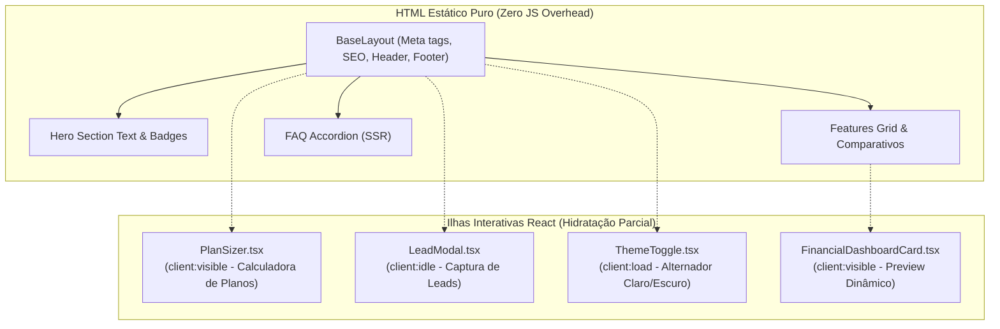

# Especificação Técnica: Landing Page Comercial (Astro & Tailwind CSS v4)

> **Categoria:** Referência Técnica (Frontend & Apresentação)
> **Relacionados:** [MOC do Frontend](index.md) · [Componentes UI](ui-components-spec.md) · [Visão Geral do Sistema](../../architecture/concepts/system-overview.md) · [Racional do Design System](../../architecture/concepts/design-system-rationale.md)

---

## 1. Visão Geral

A **Landing Page** do *Wedding Management System* (`landing/`) é a vitrine pública, institucional e comercial da plataforma (**Sim, Aceito!**). Ela é responsável pela aquisição de leads, conversão de novos clientes (assessores e casais), apresentação das propostas de valor dos módulos e precificação.

Diferente do aplicativo principal (que é uma Single Page Application / SPA em **React 19** focada em operações autenticadas), a Landing Page foi desenvolvida sobre o **Astro 7**, priorizando **Static Site Generation (SSG)**, tempo de carregamento ultrarrápido, otimização para mecanismos de busca (SEO) e pontuações máximas no Google Core Web Vitals.

---

## 2. Pilares Tecnológicos & Dependências

As dependências declaradas em `landing/package.json` refletem o estado da arte do ecossistema moderno de frontend:

| Camada / Função | Pacote / Tecnologia | Versão | Propósito |
| :--- | :--- | :--- | :--- |
| **Framework Core** | `astro` | `^7.1.1` | Gerador de sites estáticos com arquitetura de ilhas (*Islands Architecture*). |
| **Integração React** | `@astrojs/react` | `^6.0.2` | Hidratação de componentes interativos client-side. |
| **Biblioteca de UI** | `react`, `react-dom` | `^19.2.8` | Componentes interativos compartilhados com o design system. |
| **Motor de Estilização**| `tailwindcss`, `@tailwindcss/vite` | `^4.3.3` | Tailwind CSS v4 com compilação de alta performance via plugin do Vite. |
| **Animações** | `tw-animate-css` | `^1.4.0` | Transições e keyframes para micro-interações. |
| **Componentes Base** | `shadcn`, `radix-ui` | `^4.18.0` / `^1.6.7` | Primitivas acessíveis para modais, accordions e abas. |
| **Ícones** | `lucide-react` | `^1.31.0` | Conjunto unificado de ícones SVG. |
| **Tipografia Variável**| `@fontsource-variable/*` | `^5.3.0` | Fontes *Plus Jakarta Sans*, *IBM Plex Sans* e *JetBrains Mono*. |
| **Linter & Tipagem** | `oxlint`, `typescript`, `@astrojs/check` | `^1.78.0` / `^6.0.3` | Linting de alta velocidade e verificação estática de tipos. |

---

## 3. Arquitetura de Ilhas (Islands Architecture)

A Landing Page utiliza a **Arquitetura de Ilhas do Astro**, onde a vasta maioria da página é renderizada como HTML puro estático no momento do build, e apenas os componentes dinâmicos são hidratados com JavaScript no navegador:



### Diretivas de Hidratação Utilizadas:
- `client:load`: Componentes críticos imediatos (ex.: alternador de tema no cabeçalho).
- `client:visible`: Componentes pesados ou abaixo da dobra (*below-the-fold*), como a calculadora de planos (`PlanSizer`) e cards animados.
- `client:idle`: Componentes de interação secundária, como o modal de captura de leads (`LeadModal`).

---

## 4. Estrutura de Componentes e Seções (`landing/src/`)

```text
landing/src/
├── components/
│   ├── landing/
│   │   ├── Header.tsx                 # Barra de navegação responsiva e CTA
│   │   ├── Hero.tsx                   # Banner principal, proposta de valor e CTAs
│   │   ├── Features.tsx               # Grid dos 3 pilares do produto
│   │   ├── FinancialDashboardCard.tsx # Mockup interativo de controle de despesas
│   │   ├── ChecklistCard.tsx          # Mockup de cronograma e marcos
│   │   ├── SuppliersCard.tsx          # Mockup de fornecedores e contratos
│   │   ├── Methodology.tsx            # O fluxo em 4 etapas da assessoria
│   │   ├── PlanSizer.tsx              # Dimensionador interativo de casamentos e custos
│   │   ├── Pricing.tsx                # Tabela de planos e assinaturas
│   │   ├── Testimonials.tsx           # Prova social e depoimentos de assessores
│   │   ├── FAQ.tsx                    # Perguntas frequentes estruturadas
│   │   ├── CTABanner.tsx              # Chamada final para conversão
│   │   ├── Footer.tsx                 # Rodapé institucional, links e copyright
│   │   └── LeadModal.tsx              # Modal controlado para lista de espera / contato
│   └── ui/                            # Primitivas shadcn (Button, Dialog, Badge, Slider, etc.)
├── contexts/
│   └── ThemeContext.tsx               # Gerenciador de tema claro/escuro via next-themes
├── data/
│   ├── landing.ts                     # Constantes de texto, planos, FAQs e depoimentos
│   └── types.ts                       # Tipos TypeScript para planos e recursos
└── pages/
    └── index.astro                    # Página principal agregadora
```

---

## 5. Fluxo de Desenvolvimento e Comandos

Todos os comandos de ciclo de vida da Landing Page estão encapsulados no `Makefile` raiz do repositório:

| Ação | Comando Makefile | Comando Nativo | Descrição |
| :--- | :--- | :--- | :--- |
| **Iniciar Dev Server** | `make landing-dev` | `cd landing && pnpm dev` | Inicia o servidor local do Astro com HMR na porta `4321`. |
| **Verificação Completa**| `make check-landing` | `cd landing && pnpm exec astro check && pnpm run build` | Executa validação de tipos TypeScript, checagem do Astro e build de produção. |
| **Análise de Linter** | `cd landing && pnpm run lint` | `oxlint .` | Executa o linter ultrarrápido Oxlint no código-fonte da landing. |
| **Visualizar Build** | `cd landing && pnpm run preview` | `astro preview` | Roda servidor local servindo a pasta `landing/dist/`. |

---

## 6. Otimização de Performance, SEO e Acessibilidade

1. **Fontes Locais sem Dependência Externa:** A Landing Page utiliza as fontes variáveis `@fontsource-variable/*`, eliminando conexões externas ao Google Fonts em tempo de execução e acelerando o First Contentful Paint (FCP).
2. **Design Tokens Unificados:** O arquivo `landing/src/styles/global.css` implementa os mesmos tokens do [DESIGN.md](../../../DESIGN.md) da aplicação (*Violet Aura* `#7C3AED` e *Surface Dark* `#09090B`).
3. **Metadados e Open Graph:** A página inclui tags semânticas para indexação em buscadores e cards enriquecidos para compartilhamento em redes sociais.
