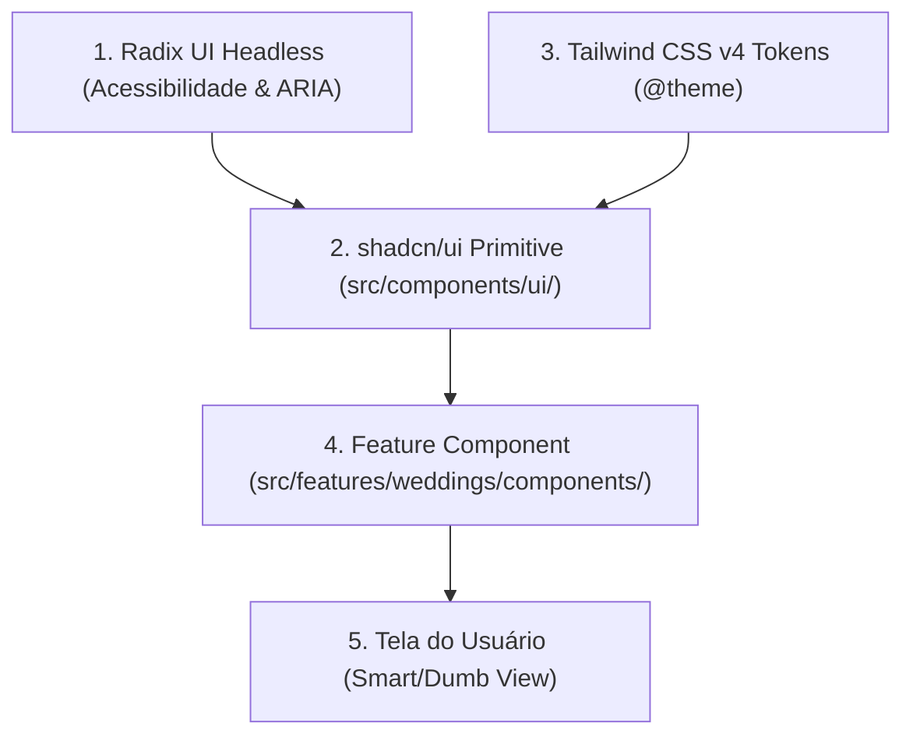

# Especificação Técnica: Componentes de UI (shadcn/ui & Tailwind CSS v4)

> **Categoria:** Referência Técnica (Frontend & Apresentação)
> **Relacionados:** [Referência de Frontend](index.md) · [Smart vs Dumb Components](../../architecture/concepts/smart-dumb-components.md) · [Design System](../../architecture/concepts/design-system-rationale.md)
> **Camada:** Frontend (`frontend/src/components/ui/` e `frontend/src/features/*/components/`)

---

## 1. Filosofia de Design e Primitivos de UI

A camada de interface do **Wedding Management System** é fundamentada em três pilares:
1. **Primitivos Headless Acessíveis (Radix UI):** Gerenciam foco no teclado, navegação ARIA, *focus traps* e portais de renderização fora do fluxo DOM.
2. **Tokens Utilitários Modernos (Tailwind CSS v4):** Estilização de alta performance baseada em variáveis CSS inline `@theme` sem build legada.
3. **Class Variance Authority (CVA):** Tipagem estática e segura para múltiplas variantes visuais e tamanhos de cada componente.



---

## 2. Catálogo de Componentes Primitivos e Variantes

Os arquivos em `src/components/ui/` são **estritamente agnósticos ao domínio**.

| Componente | Primitivo Base | Variantes Suportadas | Padrão de Acessibilidade (WCAG) |
| :--- | :--- | :--- | :--- |
| **`Button`** | Radix Slot | `variant`: `default`, `destructive`, `outline`, `secondary`, `ghost`, `link`<br>`size`: `default`, `sm`, `lg`, `icon` | Suporte a `disabled`, `aria-busy` e ícone de loading inline. |
| **`Dialog` / `Sheet`** | Radix Dialog / Dialog | Modais modais centralizados e gavetas laterais deslizantes. | **Obrigatório:** `DialogTitle` e `DialogDescription` explícitos para leitores de tela. |
| **`AlertDialog`** | Radix AlertDialog | Confirmação de ações destrutivas irreversíveis (ex: exclusão de contrato). | Foco automático no botão de cancelamento seguro. |
| **`Form`** | RHF + Radix Label | `Form`, `FormField`, `FormItem`, `FormLabel`, `FormControl`, `FormMessage` | Conexão automática de `aria-describedby` e `aria-invalid` em erros. |
| **`Input` / `Textarea`** | HTML Input / Textarea | Estados: `default`, `focus-visible`, `disabled`, `error` | Borda `border-destructive` e foco acessível via ring Tailwind. |
| **`Select`** | Radix Select | Dropdown customizado com scroll e busca. | Navegação completa por setas e teclado (Enter/Esc). |
| **`Table`** | HTML Table | `Table`, `TableHeader`, `TableBody`, `TableRow`, `TableHead`, `TableCell` | Cabeçalhos semânticos (`<th>`) e suporte a linhas selecionáveis. |
| **`Badge`** | CVA | `default`, `secondary`, `destructive`, `outline`, `success` | Contraste de cor validado (taxa mínima de contraste 4.5:1). |
| **`Skeleton`** | Div pulsante | Placeholder retangular e circular com animação `animate-pulse`. | `aria-hidden="true"` para não poluir leitores de tela. |
| **`Sonner` (Toast)** | Sonner | Notificações do sistema (`toast.success`, `toast.error`, `toast.info`). | Disparo via região `aria-live="polite"`. |

---

## 3. Padrão de Composição em Features

### 3.1 Regras de Ouro
1. **Nunca modifique `src/components/ui/*` diretamente.**
2. Componha múltiplos primitivos dentro de `src/features/<modulo>/components/`.
3. Utilize a função utilitária `cn()` de `@/lib/utils` para mesclar classes condicionais e sobrescrever espaçamentos.

### 3.2 Exemplo de Composição: Card de Casamento
```tsx
// frontend/src/features/weddings/components/WeddingCard.tsx
import { Calendar, Users, DollarSign } from "lucide-react";
import { Card, CardHeader, CardTitle, CardContent, CardFooter } from "@/components/ui/card";
import { Badge } from "@/components/ui/badge";
import { Button } from "@/components/ui/button";
import { cn } from "@/lib/utils";
import type { WeddingOut } from "@/api/generated/model";

interface WeddingCardProps {
  wedding: WeddingOut;
  onSelect: (uuid: string) => void;
  className?: string;
}

export function WeddingCard({ wedding, onSelect, className }: WeddingCardProps) {
  return (
    <Card className={cn("hover:shadow-md transition-shadow", className)}>
      <CardHeader className="flex flex-row items-center justify-between pb-2">
        <CardTitle className="text-lg font-bold">{wedding.name}</CardTitle>
        <Badge variant={wedding.status === "ACTIVE" ? "default" : "secondary"}>
          {wedding.status}
        </Badge>
      </CardHeader>

      <CardContent className="space-y-2 text-sm text-muted-foreground">
        <div className="flex items-center gap-2">
          <Calendar className="h-4 w-4" />
          <span>{new Date(wedding.date).toLocaleDateString("pt-BR")}</span>
        </div>
        <div className="flex items-center gap-2">
          <Users className="h-4 w-4" />
          <span>{wedding.guest_count} convidados estimados</span>
        </div>
      </CardContent>

      <CardFooter>
        <Button variant="outline" className="w-full" onClick={() => onSelect(wedding.uuid)}>
          Gerenciar Casamento
        </Button>
      </CardFooter>
    </Card>
  );
}
```
