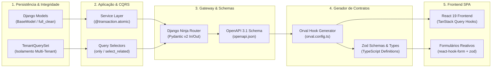

# Referência Técnica & Engenharia de Baixo Nível

> **Categoria:** Referência Técnica (Especificações Normativas, Contratos & Schemas)
> **Relacionados:** [Guias & Onboarding](../guides/index.md) · [System Design Fullstack](../architecture/index.md) · [Hub de APIs](api/index.md) · [Módulos Terraform](terraform/index.md) · [Suíte de Guard-Rails](architecture-standards/guard-rails/index.md)

Portal executivo do desenvolvedor com especificações de baixo nível, contratos OpenAPI, esquemas de infraestrutura Terraform e normas de governança de código.

[:material-sync: Pipeline Fullstack](#toolchain-fullstack-pipeline-de-contratos){ .md-button .md-button--primary }
[:material-view-grid: Catálogo de Referências](#catalogo-de-especificacoes-e-referencia-tecnica){ .md-button }
[:material-book-open-page-variant: Guias & Onboarding](../guides/index.md){ .md-button }
[:material-code-json: Schemas OpenAPI](api/openapi-schema.md){ .md-button }

---

## Toolchain Fullstack: Pipeline de Contratos & Tipagem Estrita

A engenharia do **Wedding Management System** é estritamente orientada a contratos (*Contract-Driven Development*). A integridade do domínio trafega desde a definição do modelo relacional no banco de dados até a renderização do formulário reativo no frontend, eliminando redundâncias e divergências de tipagem em tempo de execução:

### Ciclo de Desenvolvimento em 5 Etapas

1. **Modelos & BaseModel (`full_clean`):** Todas as entidades herdam de `BaseModel` e `TenantModel`, forçando validação rigorosa (`full_clean()`) em qualquer operação de persistência (`save()`).
2. **Segregação CQRS:** Mutações de estado residem exclusivamente em `services/` envolvidas em `@transaction.atomic`. Leituras e projeções residem em `selectors/` com filtros de tenant obrigatórios.
3. **Routers & OpenAPI 3.1:** Endpoints Django Ninja validam payloads com Pydantic v2 e exigem `operation_id` explícito para padronizar o nome das operações.
4. **Sincronização com Orval:** O comando `make sync-api` exporta o schema OpenAPI do backend e gera automaticamente hooks do TanStack Query e validadores Zod.
5. **Apresentação no React 19:** Componentes consom hooks tipados (`use*Query`, `use*Mutation`) integrados a `react-hook-form` e `zodResolver`, sem chamadas manuais a `fetch` ou `axios`.

---

## Catálogo de Especificações & Referência Técnica

Navegue pelas especificações técnicas normativas, contratos e schemas divididos por áreas de engenharia:

-   :material-api:{ .lg .middle } **APIs, OpenAPI & Envelopes de Erro**

    ---

    Contratos normativos de comunicação HTTP, schemas OpenAPI 3.1 do Django Ninja e envelope padronizado de erro RFC 7807.

    [:octicons-arrow-right-24: Hub Geral de APIs REST](api/index.md)
    [:octicons-arrow-right-24: Contrato OpenAPI 3.1 (Swagger)](api/openapi-schema.md)
    [:octicons-arrow-right-24: Padronização de Envelopes de Erro](api/error-envelope-spec.md)

-   :material-database:{ .lg .middle } **Modelos de Dados & Entidades**

    ---

    Estrutura atômica de classes base, mixins de auditoria, isolamento multi-tenant e mapeamento de agregados por domínio.

    [:octicons-arrow-right-24: Modelos Base & Padrões Core](models/core-models.md)
    [:octicons-arrow-right-24: Modelos por Domínio (ERD & Agregados)](../architecture/domains/index.md)

-   :material-cloud-outline:{ .lg .middle } **Infraestrutura como Código (Terraform IaC)**

    ---

    Especificações HCL modulares, módulos GCP Cloud Run, Cloud Scheduler, Cloudflare R2 e catálogo completo de variáveis de ambiente.

    [:octicons-arrow-right-24: Catálogo de Módulos Terraform](terraform/index.md)
    [:octicons-arrow-right-24: Módulo GCP Cloud Run Service](terraform/cloud-run-service-module.md)
    [:octicons-arrow-right-24: Dicionário de Variáveis de Ambiente (.env)](environment/environment-variables.md)
    [:octicons-arrow-right-24: Serviços de Infraestrutura Core](architecture-standards/infrastructure-services.md)

-   :material-test-tube:{ .lg .middle } **Suíte de Testes Automatizados**

    ---

    Diretrizes de testes em múltiplos níveis da pirâmide: unitários, integração, isolamento multitenant, mocks MSW e automação E2E.

    [:octicons-arrow-right-24: MOC da Suíte de Testes](testing/index.md)
    [:octicons-arrow-right-24: Testes Backend (Pytest & Factories)](testing/backend-testing-spec.md)
    [:octicons-arrow-right-24: Testes Frontend (Vitest & MSW)](testing/frontend-testing-spec.md)
    [:octicons-arrow-right-24: Testes Ponta a Ponta (Playwright E2E)](testing/e2e-testing-spec.md)
    [:octicons-arrow-right-24: Testes Unitários de IaC (Terraform)](testing/terraform-testing-spec.md)

-   :material-shield-check:{ .lg .middle } **Padrões de Qualidade & Guard-Rails**

    ---

    Normas de engenharia, governança de código, convenção de commits semânticos, docstrings em PT-BR e suíte de auditoria dinâmica.

    [:octicons-arrow-right-24: Visão Geral dos Padrões](architecture-standards/index.md)
    [:octicons-arrow-right-24: Padrões de Documentação Diátaxis](architecture-standards/documentation-standards.md)
    [:octicons-arrow-right-24: Padrão Query Selectors & Managers](architecture-standards/query-selectors-spec.md)
    [:octicons-arrow-right-24: Convenção de Commits Semânticos](architecture-standards/commit-convention-spec.md)
    [:octicons-arrow-right-24: Padrão de Comentários & Docstrings](architecture-standards/commenting-standards.md)
    [:octicons-arrow-right-24: Catálogo de Guard-Rails de Integridade](architecture-standards/guard-rails/index.md)

-   :material-layers-triple:{ .lg .middle } **CI/CD & Esteiras de Entrega**

    ---

    Pipelines de integração e entrega contínua no GitHub Actions, gates locais de qualidade e automação GitOps com Terraform.

    [:octicons-arrow-right-24: MOC de CI/CD Pipelines](ci-cd/index.md)
    [:octicons-arrow-right-24: Validação de Pull Requests (CI)](ci-cd/ci-pr-validation-spec.md)
    [:octicons-arrow-right-24: Deploy Contínuo (CD)](ci-cd/cd-deploy-spec.md)
    [:octicons-arrow-right-24: Pipelines do Terraform](ci-cd/terraform-pipelines-spec.md)
    [:octicons-arrow-right-24: Revisão Automatizada de Código](ci-cd/ai-code-review-spec.md)

-   :material-react:{ .lg .middle } **Frontend Specs & Design System**

    ---

    Especificações visuais do portal comercial em Astro, componentes primitivos shadcn/ui, tipografia, tokens Tailwind CSS v4 e arquitetura de stores Zustand.

    [:octicons-arrow-right-24: Visão Geral do Frontend](frontend/index.md)
    [:octicons-arrow-right-24: Landing Page Comercial (Astro 7)](frontend/landing-page-spec.md)
    [:octicons-arrow-right-24: Componentes UI & Design Tokens](frontend/ui-components-spec.md)
    [:octicons-arrow-right-24: Gerenciamento de Estado & Stores Zustand](frontend/store-state-spec.md)

