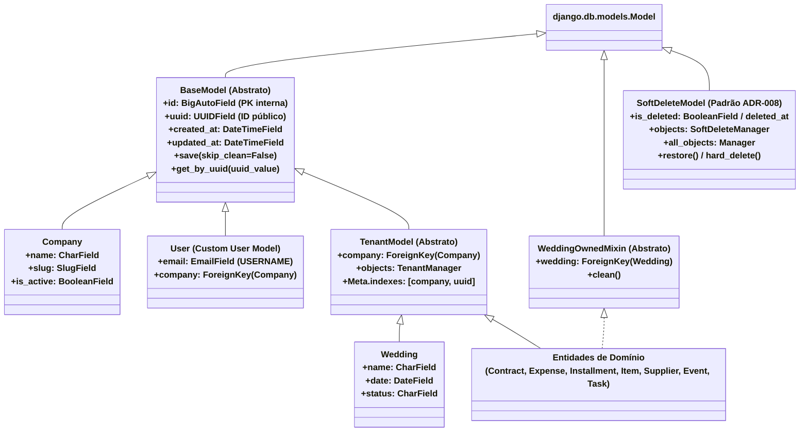

# Referência Técnica: Modelos Base & Padrões Core

> **Módulo:** [core-domain](../../architecture/domains/core-domain.md) | [tenants-domain](../../architecture/domains/tenants-domain.md) | [multi-tenancy-strategy](../../architecture/concepts/multi-tenancy-strategy.md)
> **Camada:** Backend (`backend/apps/core/models.py`, `backend/apps/core/mixins.py`, `backend/apps/tenants/models.py`)

---

## 1. Visão Geral

Os modelos base e mixins do **Wedding Management System** estabelecem a fundação transversal de integridade de dados, isolamento multi-tenant, auditoria temporal e convenções de chaves primárias seguras para toda a plataforma.

Todas as entidades de domínio do sistema derivam direta ou indiretamente dessa hierarquia de classes, garantindo conformidade arquitetural uniforme sem duplicação de regras.

---

## 2. Diagrama de Hierarquia de Classes

O diagrama abaixo ilustra as relações de herança e composição entre os modelos abstratos fundamentais, mixins e as entidades concretas de domínio:



---

## 3. Especificação dos Modelos e Padrões Fundamentais

### 3.1 `BaseModel` (Integridade, Chaves Híbridas e Auditoria)

O `BaseModel` (`backend/apps/core/models.py`) é a classe base abstrata herdada por **todas** as tabelas do sistema. Ele combina três responsabilidades cruciais:

#### A. Validação Automática com `full_clean()` no `save()` (ADR-011)
Por padrão, o Django ORM não invoca o método `full_clean()` antes de persistir instâncias via `.save()`. O `BaseModel` sobrescreve `.save()` para executar obrigatoriamente a validação completa de campos e regras de negócio (`clean()`), blindando a persistência contra estados inconsistentes originados de qualquer ponto (APIs, Django Admin, shell ou jobs em background).
- **Escape Hatch Controlado (`skip_clean=True`)**: Permite ignorar o `full_clean()` exclusivamente em rotinas de performance crítica, como `bulk_create`, fixtures de teste ou migrações de dados controladas.

#### B. Padrão de Chaves Híbridas / `HybridKeysMixin` (ADR-007)
Combina performance interna e segurança externa:
- **`id` (`BigAutoField`, PK)**: Inteiro sequencial de 8 bytes de alto desempenho, utilizado internamente pelo PostgreSQL para indexação primária e resolução ultrarrápida de `JOINs`.
- **`uuid` (`UUIDField`, seguro e indexado)**: Identificador globalmente único (`uuid4`), imutável e exposto publicamente para contratos de API REST e rotas de frontend, prevenindo ataques de enumeração e IDOR (*Insecure Direct Object References*).

#### C. Auditoria Temporal / `AuditModel`
- **`created_at` (`DateTimeField`, `auto_now_add=True`)**: Timestamp imutável do momento exato de inserção do registro.
- **`updated_at` (`DateTimeField`, `auto_now=True`)**: Timestamp atualizado automaticamente a cada mutação persistida.

#### Implementação Real (`backend/apps/core/models.py`):
```python
--8<-- "backend/apps/core/models.py:7:35"
```

---

### 3.2 `TenantModel` (Isolamento Multi-Tenant Vertical)

O `TenantModel` (`backend/apps/tenants/models.py`) é a classe base abstrata para todas as entidades de negócio pertencentes a uma organização ([ADR-009](../../architecture/adr/009-multitenancy.md), [ADR-016](../../architecture/adr/016-pragmatic-multi-tenancy.md)).

#### Características e Regras:
1. **Chave `company` Mandatória**: Chave estrangeira não nula para `tenants.Company` com `on_delete=models.CASCADE`.
2. **`TenantManager` Padronizado**: Associa o manager customizado que fornece a interface `.for_tenant(company)`, retornando um `TenantQuerySet` seguro com predicado SQL `WHERE company_id = ...`.
3. **Índice Composto de Alta Performance**: Índice B-Tree composto sobre `(company, uuid)` otimizando lookups públicos dentro do contexto do tenant autenticado.

#### Implementação Real (`backend/apps/tenants/models.py`):
```python
--8<-- "backend/apps/tenants/models.py:27:48"
```

---

### 3.3 `WeddingOwnedMixin` (Isolamento Horizontal de Eventos)

O `WeddingOwnedMixin` (`backend/apps/core/mixins.py`) é aplicado a entidades que operam dentro do escopo de um casamento específico (despesas, fornecedores vinculados, contratos, itens e tarefas).

#### Regras de Validação em `clean()`:
- **Blindagem Vertical (Cross-Tenant Guard)**: Garante que `instance.company_id == instance.wedding.company_id`. Impede que um casamento de uma empresa seja associado a um registro de outra empresa.
- **Consistência Horizontal (Cross-Wedding Guard)**: Varre dinamicamente todas as FKs concretas da entidade e valida se os objetos relacionados pertencem ao mesmo `wedding_id`.

#### Implementação Real (`backend/apps/core/mixins.py`):
```python
--8<-- "backend/apps/core/mixins.py:5:52"
```

---

### 3.4 `SoftDeleteModel` (Padrão de Exclusão Lógica Seletiva)

Conforme estabelecido no [ADR-008: Soft Delete Seletivo](../../architecture/adr/008-soft-delete.md):

- **Objetivo**: Proteger entidades de negócio críticas contra exclusões acidentais, mantendo histórico de auditoria e capacidade de restauração (`restore()`), sem quebrar chaves estrangeiras.
- **Estrutura do Padrão**:
  - Flag de exclusão: `is_deleted = BooleanField(default=False)` ou `deleted_at = DateTimeField(null=True, blank=True)`.
  - `SoftDeleteQuerySet` / `SoftDeleteManager`: Manager padrão `objects` filtra registros deletados (`WHERE is_deleted = False`), enquanto `all_objects` permite consultas administrativas completas.
  - Métodos `delete()` (soft), `restore()` (recuperação) e `hard_delete()` (purga definitiva).
- **Diretriz de Aplicação Seletiva**:
  - :material-check-circle: **Aplicado a Entidades Configuráveis & Cadastros**: `Wedding`, `Supplier`, `Contract`, `Item`.
  - :material-close-circle: **Não Aplicado a Registros Financeiros Estritos ou Transitórios**: `Installment` (imutabilidade financeira e tolerância zero — [ADR-010](../../architecture/adr/010-tolerance-zero.md)), `Notification` e `Event` temporários (purga física por retenção).

---

## 4. Matriz de Herança e Mixins por Entidade de Domínio

| Entidade | Módulo | Herança Base | Mixins Aplicados | Identificação Pública | Isolamento |
| :--- | :--- | :--- | :--- | :--- | :--- |
| **`Company`** | `tenants` | `BaseModel` | — | `uuid` + `slug` | Root Tenant |
| **`User`** | `users` | `AbstractBaseUser`, `PermissionsMixin` | `HybridKeysMixin` | `uuid` + `email` | `company_id` |
| **`Wedding`** | `weddings` | `TenantModel` | — | `uuid` | `company_id` |
| **`Budget`** | `finances` | `TenantModel` | `WeddingOwnedMixin` | `uuid` | `company` + `wedding` |
| **`BudgetCategory`** | `finances` | `TenantModel` | `WeddingOwnedMixin` | `uuid` | `company` + `wedding` |
| **`Expense`** | `finances` | `TenantModel` | `WeddingOwnedMixin` | `uuid` | `company` + `wedding` |
| **`Installment`** | `finances` | `TenantModel` | `WeddingOwnedMixin` | `uuid` | `company` + `wedding` |
| **`Supplier`** | `logistics` | `TenantModel` | — | `uuid` | `company_id` |
| **`Contract`** | `logistics` | `TenantModel` | `WeddingOwnedMixin` | `uuid` | `company` + `wedding` |
| **`Item`** | `logistics` | `TenantModel` | `WeddingOwnedMixin` | `uuid` | `company` + `wedding` |
| **`Event`** | `scheduler` | `TenantModel` | `WeddingOwnedMixin` | `uuid` | `company` + `wedding` |
| **`Task`** | `scheduler` | `TenantModel` | `WeddingOwnedMixin` | `uuid` | `company` + `wedding` |
| **`Notification`** | `notifications` | `TenantModel` | — | `uuid` | `company` + `user` |

---

## 5. Documentos Relacionados

- [Estratégia de Multi-Tenancy](../../architecture/concepts/multi-tenancy-strategy.md)
- [Padrão Service Layer](../../architecture/concepts/service-layer-pattern.md)
- [Padrão Query Selectors](../../architecture/concepts/query-selectors-pattern.md)
- [ADR-007: Chaves Híbridas](../../architecture/adr/007-hybrid-keys.md)
- [ADR-008: Soft Delete Seletivo](../../architecture/adr/008-soft-delete.md)
- [ADR-009: Multitenancy](../../architecture/adr/009-multitenancy.md)
- [ADR-011: BaseModel full_clean](../../architecture/adr/011-basemodel-save-full-clean.md)
- [ADR-016: Multi-tenancy Pragmático](../../architecture/adr/016-pragmatic-multi-tenancy.md)
- [Visão Geral dos Domínios](../../architecture/domains/index.md)
