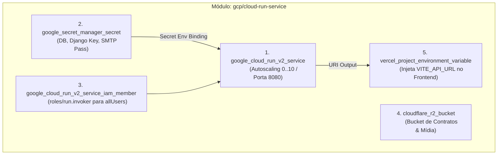

# Especificação Técnica: Módulo Terraform Cloud Run Service (GCP & Multi-Cloud)

> **Categoria:** Referência Técnica (Terraform & IaC)
> **Relacionados:** [MOC de Terraform](index.md) · [ADR-025: Arquitetura Terraform](../../architecture/adr/025-terraform-iac-architecture.md) · [Testes Terraform](../testing/terraform-testing-spec.md) · [Pipelines Terraform](../ci-cd/terraform-pipelines-spec.md)
> **Caminho do Módulo:** `terraform/modules/gcp/cloud-run-service/`

---

## 1. Visão Geral e Escopo Multi-Cloud

O módulo **`gcp/cloud-run-service`** é responsável pela orquestração multi-provedor da infraestrutura de backend da plataforma:
1. **Google Cloud Platform:** Provisionamento do serviço serverless Cloud Run v2, contêineres no Secret Manager e concessões IAM de acesso.
2. **Cloudflare:** Provisionamento declarativo de buckets S3 compatíveis no **Cloudflare R2** para armazenamento de contratos e mídia.
3. **Vercel:** Registro automático da URL gerada do Cloud Run (`service_uri`) na variável de ambiente `VITE_API_URL` do projeto frontend.



---

## 2. Tabela de Variáveis de Entrada (Inputs)

| Variável | Tipo | Requerida | Padrão | Descrição & Validação |
| :--- | :--- | :--- | :--- | :--- |
| **`environment`** | `string` | Sim | - | Nome do ambiente (`staging` ou `production`). Validado via `contains()`. |
| **`service_name`** | `string` | Sim | - | Nome do serviço Cloud Run v2 provisionado. |
| **`gcp_region`** | `string` | Não | `"us-central1"` | Região geográfica no GCP para o Cloud Run. |
| **`database_secret_id`** | `string` | Sim | - | ID do contêiner do segredo de banco de dados no Secret Manager. |
| **`django_secret_id`** | `string` | Sim | - | ID do contêiner do segredo da `SECRET_KEY` do Django. |
| **`email_smtp_password_secret_id`** | `string` | Sim | - | ID do segredo da senha/API key SMTP. |
| **`r2_bucket_name`** | `string` | Sim | - | Nome do bucket Cloudflare R2 associado. |
| **`cloudflare_account_id`** | `string` | Sim | - | Account ID do Cloudflare para gerenciamento de storage. |
| **`deployer_email`** | `string` | Sim | - | E-mail da Service Account do deployer CI/CD. |
| **`runtime_email`** | `string` | Sim | - | E-mail da Service Account de runtime do Cloud Run. |
| **`web_app_project_id`** | `string` | Sim | - | ID do projeto SPA na Vercel para injeção de URL. |
| **`vercel_target`** | `list(string)` | Sim | - | Ambientes Vercel de destino (`["production"]` ou `["preview"]`). |
| **`vercel_git_branch`** | `string` | Não | `null` | Branch Git específica na Vercel para ambientes preview. |
| **`initial_image`** | `string` | Sim | - | Imagem OCI de referência inicial para o primeiro deploy. |
| **`max_concurrency`** | `number` | Não | `80` | Concorrência máxima de requisições simultâneas por container. |
| **`tasks_backend`** | `string` | Não | `"db"` | Backend de processamento de tarefas em segundo plano. |

---

## 3. Tabela de Variáveis de Saída (Outputs)

| Output | Tipo | Descrição |
| :--- | :--- | :--- |
| **`service_uri`** | `string` | URL HTTPS pública atribuída ao serviço Cloud Run pelo Google Cloud. |
| **`service_name`** | `string` | Nome canônico do serviço Cloud Run registrado no GCP. |
| **`database_secret_id`** | `string` | ID do contêiner de segredo do banco de dados provisionado. |
| **`django_secret_id`** | `string` | ID do contêiner de segredo do Django provisionado. |
| **`email_smtp_password_secret_id`** | `string` | ID do contêiner de segredo SMTP provisionado. |
| **`r2_bucket_name`** | `string` | Nome do bucket R2 gerenciado no Cloudflare. |

---

## 4. Recursos Gerenciados e Lifecycles de Segurança

### 4.1 `google_cloud_run_v2_service.wedding_api`
- **Porta:** 8080.
- **Ingress:** `INGRESS_TRAFFIC_ALL`.
- **Autoscaling:** Escalonamento automático de `min_instance_count = 0` (zero cold cost em staging) até `max_instance_count = 10`.
- **Concorrência:** 80 conexões HTTP por réplica.
- **`lifecycle { ignore_changes }`:**
  ```hcl
  lifecycle {
    prevent_destroy = true
    ignore_changes = [
      template[0].containers[0].image,
      template[0].containers[0].env,
      template[0].containers[0].resources,
      template[0].containers[0].startup_probe
    ]
  }
  ```
  *Racional:* Permite que o pipeline de CD da aplicação (GitHub Actions) atualize imagens e variáveis sem conflitar com o estado do Terraform.

---

## 5. Suíte de Testes Declarativos (`unit_test.tftest.hcl`)

O módulo é validado localmente e no CI via `terraform test`:
- Utiliza `mock_provider` nativo para `google`, `cloudflare` e `vercel`.
- Executa em modo `command = plan`, garantindo que nomes de recursos, bindings IAM e lifecycles estão corretos sem criar infraestrutura real na nuvem.
