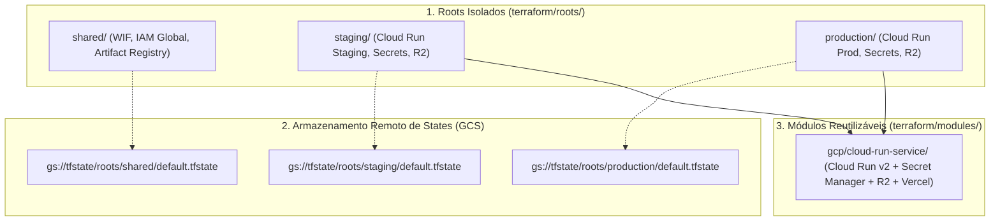

# Especificações Técnicas de Infraestrutura como Código (Terraform IaC MOC)

> **Categoria:** Referência Técnica (Terraform & IaC)
> **Relacionados:** [ADR-025: Arquitetura Terraform](../../architecture/adr/025-terraform-iac-architecture.md) · [ADR-027: Topologia de States](../../architecture/adr/027-terraform-state-topology.md) · [Pipelines Terraform](../ci-cd/terraform-pipelines-spec.md) · [Testes Terraform](../testing/terraform-testing-spec.md)

---

## 1. Visão Geral da Arquitetura de IaC

A infraestrutura do **Wedding Management System** é declarada integralmente em HCL através do **Terraform 1.7.5**, operando sob uma topologia estrita de **3 Roots Desacoplados** e **Módulos Reutilizáveis Testáveis**.

---

## 2. Topologia de Isolamento de Estados (State Isolation)

Para eliminar o risco de efeito dominó (*blast radius* reduzido), o estado do Terraform é dividido em 3 arquivos `.tfstate` independentes:

1. **`roots/shared`:** Contém recursos fundamentais compartilhados que raramente mudam (Workload Identity Pools, Artifact Registry, permissões IAM globais).
2. **`roots/staging`:** Ambiente de homologação do backend e frontend.
3. **`roots/production`:** Ambiente de produção com travas estritas de destruição (`prevent_destroy = true`) e autorização manual de apply.

---

## 3. O Contrato de 5 Arquivos por Módulo

Todo módulo sob `terraform/modules/` deve conter obrigatoriamente os seguintes 5 arquivos:

1. **`versions.tf`:** Versão travada do Terraform (`required_version = "= 1.7.5"`) e provedores (`google`, `cloudflare`, `vercel`).
2. **`variables.tf`:** Entradas fortemente tipadas com blocos `validation {}` e mensagens de erro em português.
3. **`main.tf`:** Recursos de infraestrutura com `lifecycle` explícito.
4. **`outputs.tf`:** Valores exportados com `description` clara em PT-BR acentuada.
5. **`tests/unit_test.tftest.hcl`:** Suíte de testes unitários declarativos nativos em `command = plan` (consulte [terraform-testing-spec](../testing/terraform-testing-spec.md)).

---

## 4. Especificações Atômicas de Módulos

- :material-cloud-outline: **[cloud-run-service-module.md](cloud-run-service-module.md)** — Especificação técnica do módulo GCP Cloud Run v2, Secret Manager, Cloudflare R2 e bindings de ambiente na Vercel (`terraform/modules/gcp/cloud-run-service/`).
