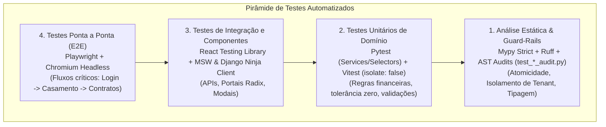

# Especificações Técnicas de Testes Automatizados (MOC & Pirâmide de Testes)

> **Categoria:** Referência Técnica (Qualidade & Testes)
> **Relacionados:** [Padrões de Arquitetura](../architecture-standards/index.md) · [MOC de Guard-Rails](../architecture-standards/guard-rails/index.md) · [MOC de CI/CD](../ci-cd/index.md)
> **Camada:** Backend (`pytest`), Frontend (`Vitest`, `RTL`), E2E (`Playwright`) e IaC (`Terraform`)

---

## 1. Visão Geral e a Pirâmide de Testes

A qualidade e estabilidade do **Wedding Management System** são sustentadas por uma suíte de testes em camadas, desenhada para maximizar a velocidade de feedback e garantir zero regressões em produção.

---

## 2. Notas Atômicas de Referência Técnica

| Nível / Camada | Ferramentas | Foco & Garantias | Link da Especificação |
| :--- | :--- | :--- | :--- |
| **Backend Testing** | `pytest`, `factory_boy`, `pytest-django` | Testes de unidade em `services/`, testes de isolamento tenant e factories sem `.objects.create()`. | [backend-testing-spec.md](backend-testing-spec.md) |
| **Frontend Testing** | `Vitest` (`isolate: false`), RTL, MSW | Testes de componentes Smart/Dumb, mocks centralizados via `registerMockHook` em `test-setup.ts`. | [frontend-testing-spec.md](frontend-testing-spec.md) |
| **E2E Testing** | `Playwright`, Chromium | Simulação de usuário real, reuso de autenticação (`storageState.json`), Page Objects e gravação de traces. | [e2e-testing-spec.md](e2e-testing-spec.md) |
| **IaC Testing** | `terraform test`, `mock_provider` | Validação de contratos HCL em `command = plan`, lifecycles de segurança e bindings IAM. | [terraform-testing-spec.md](terraform-testing-spec.md) |

---

## 3. Tabela Rápida de Comandos de Execução

| Alvo de Teste | Comando Makefile | Descrição |
| :--- | :--- | :--- |
| **Todos os Testes Backend** | `make test` | Executa a suíte Pytest com banco em memória/PostgreSQL. |
| **Cobertura Backend** | `make test-cov` | Gera relatório de cobertura HTML e terminal. |
| **Todos os Testes Frontend** | `make frontend-test` | Executa toda a suíte Vitest no frontend. |
| **Frontend Modificados** | `make frontend-test-changed` | Executa apenas os testes afetados pelo `git diff`. |
| **Suíte Ponta a Ponta (E2E)** | `make frontend-e2e` | Reseta o banco (`flush`), popula seeds e roda o Playwright. |
| **Relatório E2E** | `make frontend-e2e-report` | Abre o relatório visual interativo do Playwright. |
| **Portão Completo Local** | `make check-ci` | Executa testes, linters, tipagem e build em todos os subsistemas. |

---

## 4. Operational Skills (Playbooks On-Demand)

Os agentes e desenvolvedores utilizam os playbooks operacionais de checklist sob `.agents/skills/`:
- [wedding-backend-testing](../../../.agents/skills/wedding-backend-testing/SKILL.md) — Checklist operacional para testes backend.
- [wedding-frontend-testing](../../../.agents/skills/wedding-frontend-testing/SKILL.md) — Checklist operacional para testes frontend.
